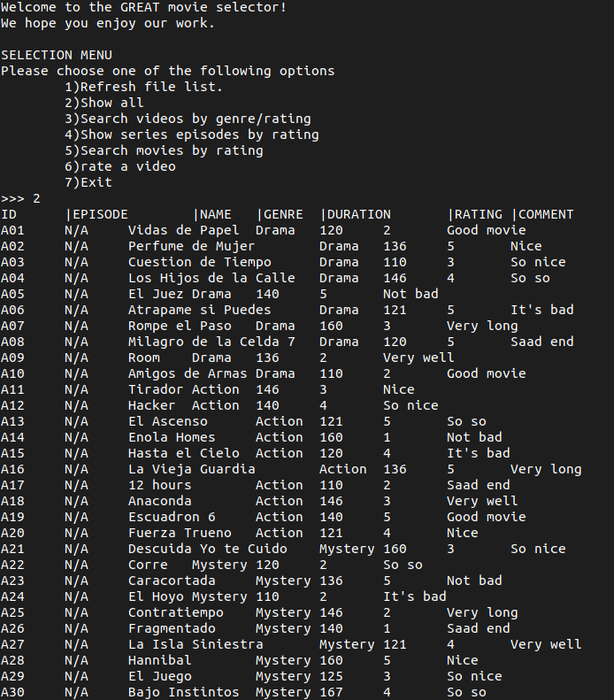
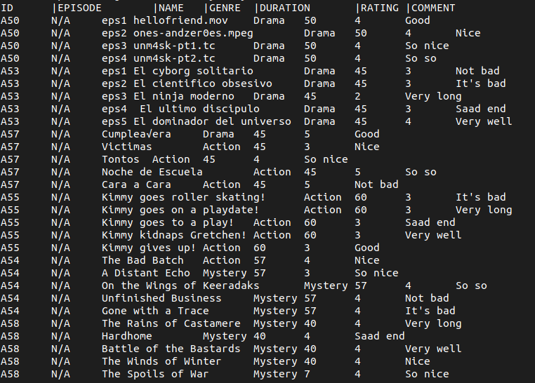
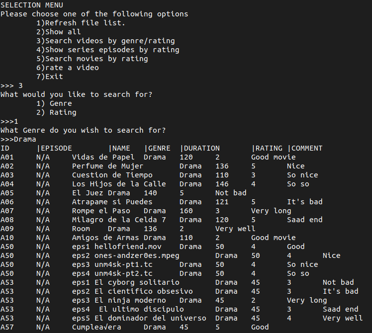
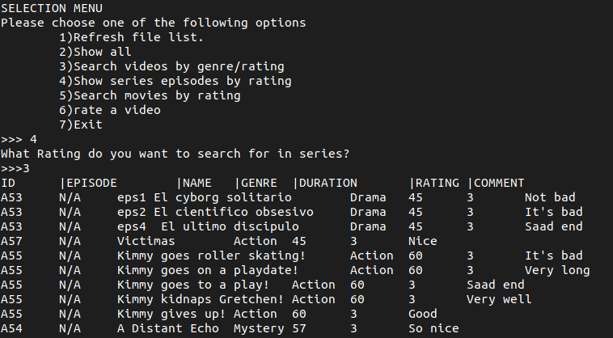
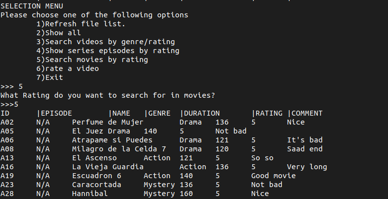
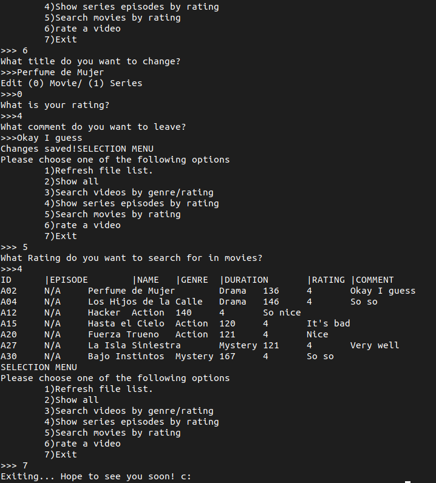

# Movie & Series picker

Created by:

Alejandro Fernandez del Valle Herrera A01024998

Andrea Yela González A01025250

Joshua Ruben Amaya Camilo A01025258

### Before we start:
[Download the code here!](https://github.com/MrDrHax/movie-surf-in-c--/archive/refs/heads/main.zip)

[Or go to the GitHub Repo here!](https://github.com/MrDrHax/movie-surf-in-c--)

This program is licensed under the GNU GENERAL PUBLIC LICENSE Version 3, 29 June 2007. 

Check LICENSE for more details

## Index:

1. [Introduction](#Introduction)
1. [UML class diagram](#UML-class-diagram)
    1. [Explanation](##Explanation)
1. [Execution](<#Execution-example>)
1. [Why we took this approach](#Why-we-took-this-approach)
1. [Cases where it might fail](#Cases-where-there-is-an-error)
1. [Conclusions](#Conclusions)
1. [References](#References)

## Introduction

During the last years, the technology has evolved to the point of being able to find any type of information with a single click; from personal data, photographs, movies, series, etc.

For their part, streaming services are increasingly complex, being able to predict a person's tastes and hobbies trough search history, and thus being able to offer accurate options for each person in particular.

In order to offer a quick and simple search, a search system has been designed according to the interests specified by the user, analyzing the database from the genre or even the rating.

## UML class diagram

### Explanation

It all starts on the main program, which creates a mainClass `centerCode`. This class is in charge of running the main loop, which calls a function that asks what to do. This redirects to all the appropriate functions, calling what is necessary in order to work properly.

All the helper functions are located outside of the class, on namespace media, including classes for videos, series, and movies. 

At the top, there is video, which is the core on what everything is designed on. Video is the main way different variables communicate, from printing searching, and saving. centerCode calls different functions with their appropriate parameters, and expects a result from them, mostly by handling arrays of videos, and giving parameters to make them work properly.

Movies and Series are practically the same, although the key difference is the way they handle videos, by giving them different parameters.

## Execution example

## Why we took this approach

The main reason why we took this approach, is because the way this is built means that anything can be edited, and it will still work correctly. We took many precautions to build everything modularly, that we, we can reuse code where needed, we can edit things without breaking other things, and most importantly, we could collaborate better.

We used namespaces and classes to make a difference in different parts of the code, ones where more tool focused, while the others where more user focused. 

To add on top of this, many classes where used as holders, or as ways to enhance other classes, such as video, that was used to store from one to many videos all at once. 

The code is also built in a way that can really take in any amount of movies, searches for many things are possible (but not active since it was not required), and an extra option to help with corrupted data was added.

Finally, in case this should be improved upon, lots of commenting was done, using Oxygen, to facilitate the reading by others.

## Cases where there is an error

We found that if the CSV file is not correct, it will fail.

Other errors include OS errors, and permission errors (i.e. not enough privileges to read file) that land far from our scope.

Otherwise, it is a pretty resilient piece of code, correct error try and catch is handled, with care to explain what happened.

Vigorous tests have been done, including random inputs.

## Conclusions

While a small challenge, it was fun trying to figure out all the challenges, to make the UI as intuitive as possible, while still holding reach features that can satisfy and go over what was required in the assignment.

Overall, it was a small little project that while might not be very useful on the real world, it does help with many proof of concept

## References

All code was built and designed by us.