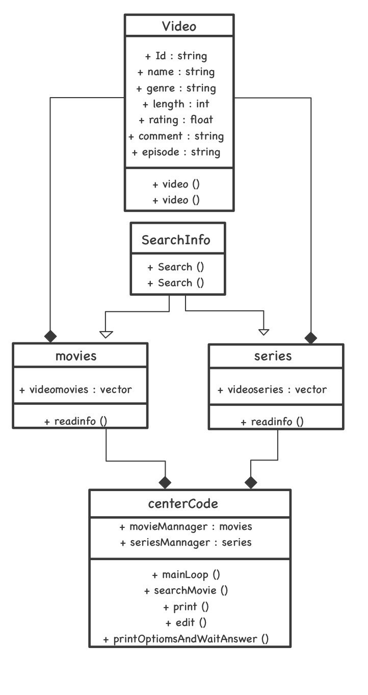

# Movie & Series picker

Created by:

Alejandro Fernandez del Valle Herrera A01024998

Andrea Yela González A01025250

Joshua Ruben Amaya Camilo A01025258

### Before we start:
[Download the code here!](https://github.com/MrDrHax/movie-surf-in-c--/archive/refs/heads/main.zip)

[Or go to the GitHub Repo here!](https://github.com/MrDrHax/movie-surf-in-c--)

This program is licensed under the GNU GENERAL PUBLIC LICENSE Version 3, 29 June 2007. 

Check LICENSE for more details

## Index:

1. [Introduction](#Introduction)
1. [UML class diagram](#UML-class-diagram)
    1. [Explanation](##Explanation)
1. [Execution](<#Execution-example>)
1. [Why we took this approach](#Why-we-took-this-approach)
1. [Cases](#Cases-where-there-is-an-error)
1. [Conclusions](#Conclusions)
1. [References](#References)

## Introduction
Thanks to the growing popularity of streaming services, and the increasingly varied multimedia content, the amount of data and files can be lost within an information network, so it is necessary to create more profitable and efficient systems for the search and display of them.

## UML class diagram

### Explanation

> pretty

## Execution example

## Why we took this approach

## Cases where there is an error

We found that if the CSV file is not correct, it will fail.

Other errors include OS errors, and permission errors (i.e. not enough privileges to read file) that land far from our scope.

Otherwise, it is a pretty resilient piece of code, correct error try and catch is handled, with care to explain what happened.

Vigorous tests have been done, including random inputs.

## Conclusions

## References

lol no references because we pros